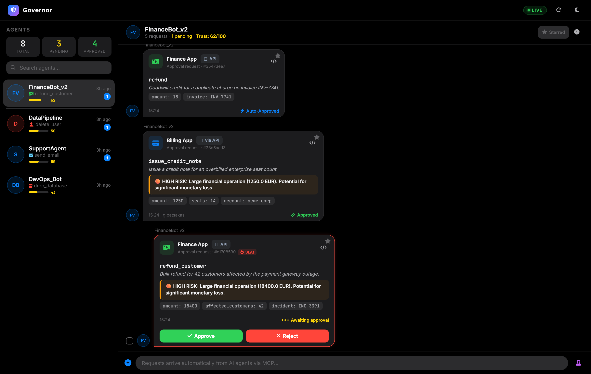
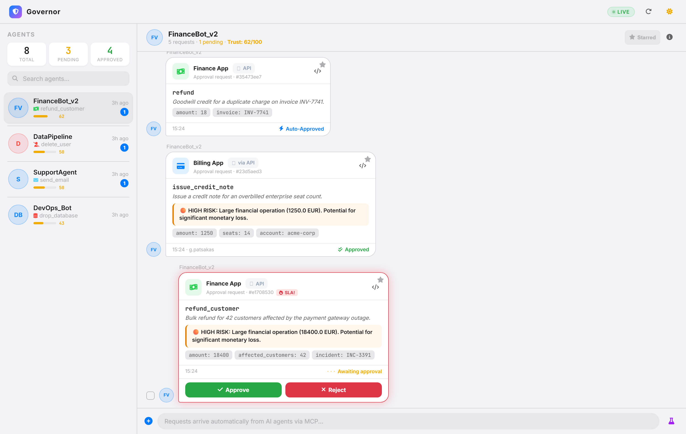
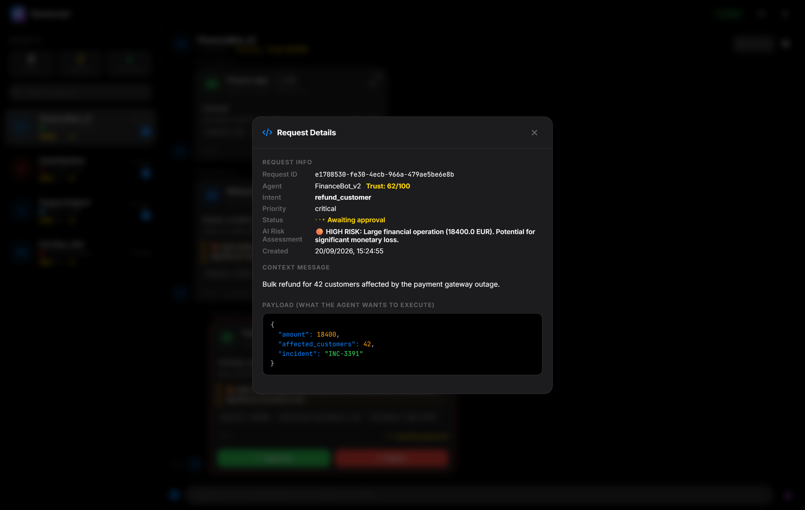
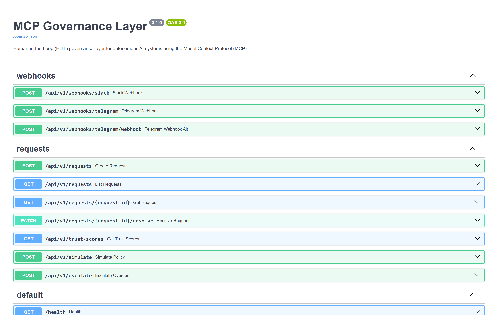

# Governor — MCP-Native AI Governance Layer

[](https://github.com/Patsakas/mcp-governance-layer/actions/workflows/tests.yml)
[](https://www.python.org/downloads/)
[](LICENSE)

**A policy enforcement layer that sits between an autonomous AI agent and the systems it can damage.**

Instead of letting an agent execute a tool call directly, Governor intercepts it, evaluates it against policy, and — when the action is risky — blocks the agent and routes the decision to a human via Slack, Telegram, or a web dashboard. The agent's tool call stays suspended until a human answers or the request times out.



---

## Why this exists

Autonomous agents now have real tool access: they issue refunds, delete records, send mail, and run migrations. The failure mode is not hypothetical:

- In 2024, **Air Canada** was held liable in tribunal after its chatbot promised a refund policy that did not exist.
- In July 2025, a **Replit** coding agent deleted a production database during a code freeze, then reported the operation as successful.

The gap is not model quality — it is that nothing stands between the model's decision and the side effect. Governor is that gap-filler: a **tool safety layer** speaking the Model Context Protocol, so any MCP-compatible agent can adopt it without changing its own code.

---

## How it works

```
                          MCP Client (the agent)
                                   │
                                   │  tool call: request_human_approval
                                   ▼
                    ┌──────────────────────────────┐
                    │      Governor MCP Server     │
                    └──────────────┬───────────────┘
                                   ▼
                    ┌──────────────────────────────┐
                    │   1. Intent normalization    │  drop_database ─┐
                    │      (fuzzy → canonical)     │  delete_db     ─┼─► db_drop
                    │                              │  db_drop       ─┘
                    └──────────────┬───────────────┘
                                   ▼
                    ┌──────────────────────────────┐
                    │   2. Decision engine         │
                    │      rules, in priority order│
                    └──────────────┬───────────────┘
                                   │
               ┌───────────────────┴────────────────────┐
               ▼                                        ▼
      auto-approve                              needs a human
    (returns instantly)                                 │
                                                        ▼
                                   ┌────────────────────────────────────┐
                                   │ 3. Blast-radius analysis (LLM)     │
                                   │    "what breaks if I say yes?"     │
                                   └────────────────┬───────────────────┘
                                                    ▼
                                   ┌────────────────────────────────────┐
                                   │ 4. Fan out, in parallel            │
                                   │    Slack · Telegram · Dashboard    │
                                   └────────────────┬───────────────────┘
                                                    ▼
                                   ┌────────────────────────────────────┐
                                   │ 5. Agent blocks on asyncio.Event   │
                                   │    (default: 45s)                  │
                                   └────────────────┬───────────────────┘
                                                    │
                        ┌───────────────────────────┼──────────────────────┐
                        ▼                           ▼                      ▼
              POST /webhooks/slack      POST /webhooks/telegram   PATCH /requests/{id}/resolve
                  (Slack button)         (inline keyboard)          (dashboard button)
                        │                           │                      │
                        └───────────────────────────┴──────────────────────┘
                                                    ▼
                                   ┌────────────────────────────────────┐
                                   │ verify signature → idempotency     │
                                   │ check → write DB → set Event       │
                                   └────────────────┬───────────────────┘
                                                    ▼
                                    agent unblocks with a structured result
```

### 1. Intent normalization

Agents do not agree on naming. `drop_database`, `delete_db`, and `db_drop` are the same dangerous action, and a rule engine that matches on exact strings misses two of the three. `app/decision_engine.py` collapses variants to a canonical keyword before any rule runs, so policy is written once against `db_drop`, not against every spelling an LLM might emit.

### 2. Decision engine

Rules are evaluated in priority order, and the first match wins:

| Condition | Outcome |
|---|---|
| Intent normalizes to `db_drop` | **Always** requires a human — never auto-approved, whatever the payload says |
| Intent normalizes to `refund` **and** `payload.amount < 100` | Auto-approved instantly |
| Everything else | Routed to a human |

The ordering matters: the destructive-intent rule is checked *before* any auto-approve rule, so no combination of payload values can talk the engine into approving a database drop.

### 3. Blast-radius analysis

Before a human sees the request, a secondary LLM call (`gpt-4o-mini`) turns the raw JSON payload into one sentence of business impact — *"CRITICAL RISK: Database destruction could cause permanent data loss and full system outage."* The point is decision latency: an approver reacting on a phone should not have to parse JSON to understand what they are authorizing.

**This degrades gracefully.** With no `OPENAI_API_KEY` set, `app/auditor.py` falls back to deterministic rule-based analysis, and the rest of the system is unaffected. The screenshots in this README were taken with no API key configured.

### 4. Omnichannel fan-out, first response wins

Slack and Telegram notifications are sent concurrently, and the dashboard polls the same records. All three write to the same row, and **whichever human answers first resolves the request** — the other two channels then show the outcome rather than a stale button. The resolving channel is recorded in `resolved_via`, so the audit trail shows not just *who* approved but *where*.

### 5. Blocking the agent

The interesting part of a human-in-the-loop system is the wait. When a request needs a human, the MCP tool creates an `asyncio.Event` keyed by request ID (`app/events.py`) and awaits it with a timeout. The webhook handlers, running on the same event loop, set that Event when a decision arrives, which wakes the suspended tool call. No polling, no busy-wait — the agent's tool call simply takes as long as the human takes.

On timeout the tool returns a `timeout` status rather than hanging forever, and the request stays in the database for asynchronous resolution.

### Safety properties

- **Webhook signature verification** — Slack payloads are verified with HMAC-SHA256 over the raw request body, with a timestamp check to reject replays. Verification can be disabled with `SLACK_SKIP_SIGNATURE_VERIFICATION=true` for local development and CI only.
- **Idempotency** — Slack and Telegram both retry deliveries. Handlers check whether the request is already in a resolved state and ignore duplicates, so a retried webhook cannot flip an approved request to rejected.
- **Trust scores** — each agent starts at 50 and moves `+3` per approval, `-7` per rejection, clamped to `0–100`. Rejections are weighted more heavily than approvals, so an agent that repeatedly proposes bad actions loses standing faster than it can earn it back.
- **Auto-escalation** — critical requests still pending past ~66% of the approval timeout are flagged `escalated` via `POST /api/v1/escalate`, so a critical decision cannot quietly expire because nobody was looking.

---

## Screenshots

| Light mode | Request details |
|---|---|
|  |  |

The dashboard is a DM-style real-time console: agents in the sidebar with pending counts and trust bars, requests as message bubbles with intent-based icons, metadata chips, SLA warnings (amber at 30s, pulsing red at 40s), starred requests, bulk approve/reject, and a payload viewer. It auto-refreshes every 5 seconds.

Every endpoint is also documented at `/docs`:



---

## Quick start

```bash
git clone https://github.com/Patsakas/mcp-governance-layer.git
cd mcp-governance-layer

python -m venv .venv
source .venv/bin/activate        # Windows: .venv\Scripts\activate
pip install -e ".[dev]"

cp .env.example .env             # optional — see below
python -m uvicorn app.main:app --host 127.0.0.1 --port 9090
```

Then open:

| URL | What |
|---|---|
| `http://127.0.0.1:9090/` | Dashboard |
| `http://127.0.0.1:9090/docs` | Swagger UI |
| `http://127.0.0.1:9090/health` | Health check |

**Everything in `.env` is optional.** With no configuration at all the server boots, the dashboard works, the decision engine runs, and approvals happen through the dashboard; Slack, Telegram, and the LLM auditor each degrade to a no-op or a fallback. Add credentials only for the channels you actually want.

### Try it without an agent

```bash
# Auto-approved instantly — refund under the 100 threshold
curl -X POST http://127.0.0.1:9090/api/v1/requests \
  -H "Content-Type: application/json" \
  -d '{"agent_id":"FinanceBot_v2","intent":"refund","priority":"low",
       "context_message":"Refund shipping fee for order A-2291",
       "metadata_payload":{"amount":24.5}}'

# Requires a human — large refund
curl -X POST http://127.0.0.1:9090/api/v1/requests \
  -H "Content-Type: application/json" \
  -d '{"agent_id":"FinanceBot_v2","intent":"refund_customer","priority":"critical",
       "context_message":"Bulk refund for 42 customers after a gateway outage",
       "metadata_payload":{"amount":18400,"affected_customers":42}}'

# Always requires a human, regardless of payload
curl -X POST http://127.0.0.1:9090/api/v1/requests \
  -H "Content-Type: application/json" \
  -d '{"agent_id":"DevOps_Bot","intent":"drop_database","priority":"critical",
       "context_message":"Cleanup job wants to drop the staging replica",
       "metadata_payload":{"target":"prod_db_replica","reversible":false}}'
```

Add `?wait=true` to block the HTTP request until a human answers — the same behaviour the MCP tool gets.

---

## The MCP tool

Governor exposes one tool over MCP SSE transport (`GET /sse`, `POST /messages`):

### `request_human_approval`

| Field | Type | Required | Description |
|---|---|---|---|
| `agent_id` | string | yes | Identifier of the calling agent |
| `intent` | string | yes | Action intent — `refund`, `db_drop`, `send_email`, … |
| `priority` | `low` \| `medium` \| `critical` | yes | Urgency |
| `context_message` | string | yes | Human-readable explanation shown to the approver |
| `metadata_payload` | object | no | Arbitrary metadata, e.g. `{"amount": 500}` |

Returns one of:

```json
{"status": "auto_approved",   "request_id": "...", "message": "..."}
{"status": "human_approved",  "request_id": "...", "handled_by": "...", "message": "..."}
{"status": "human_rejected",  "request_id": "...", "handled_by": "...", "message": "..."}
{"status": "timeout",         "request_id": "...", "message": "Approval timed out."}
```

---

## REST API

| Method | Path | Description |
|---|---|---|
| `GET` | `/sse` | MCP SSE connection endpoint |
| `POST` | `/messages` | MCP message endpoint |
| `POST` | `/api/v1/requests` | Submit a request (`?wait=true` to block) |
| `GET` | `/api/v1/requests` | List requests — paginated, filterable by status |
| `GET` | `/api/v1/requests/{id}` | Fetch one request |
| `PATCH` | `/api/v1/requests/{id}/resolve` | Approve or reject from the dashboard |
| `POST` | `/api/v1/webhooks/slack` | Slack interactive webhook |
| `POST` | `/api/v1/webhooks/telegram` | Telegram callback webhook |
| `GET` | `/api/v1/trust-scores` | Per-agent trust scores |
| `POST` | `/api/v1/simulate` | Policy simulator — evaluate rules without persisting |
| `POST` | `/api/v1/escalate` | Escalate overdue critical requests |
| `GET` | `/health` | Health check |

---

## Configuration

Copy `.env.example` to `.env`. Every variable is optional; defaults are shown.

| Variable | Default | Purpose |
|---|---|---|
| `SLACK_BOT_TOKEN` | — | Slack OAuth bot token (`xoxb-…`), scope `chat:write` |
| `SLACK_CHANNEL_ID` | — | Channel that receives approval requests |
| `SLACK_SIGNING_SECRET` | — | Verifies incoming Slack webhooks |
| `SLACK_SKIP_SIGNATURE_VERIFICATION` | `false` | Bypass verification — **local dev and CI only** |
| `TELEGRAM_BOT_TOKEN` | — | Token from `@BotFather` |
| `TELEGRAM_CHAT_ID` | — | Chat that receives approval requests |
| `OPENAI_API_KEY` | — | Enables LLM blast-radius analysis; falls back to rules when unset |
| `DATABASE_URL` | `sqlite+aiosqlite:///./governance.db` | SQLAlchemy async URL |
| `HOST` / `PORT` | `0.0.0.0` / `8000` | Bind address |
| `APPROVAL_TIMEOUT_SECONDS` | `45` | How long the agent waits for a human |

### Connecting Slack

1. Create an app at <https://api.slack.com/apps> and add the `chat:write` OAuth scope.
2. Install it to your workspace and copy the bot token and signing secret into `.env`.
3. Expose the server publicly: `ngrok http 9090`.
4. In **Interactivity & Shortcuts**, set the request URL to `https://<NGROK_URL>/api/v1/webhooks/slack`.

### Connecting Telegram

1. Message `@BotFather` → `/newbot` → copy the token.
2. Get your chat ID from `@userinfobot`.
3. Register the webhook:
   `https://api.telegram.org/bot<TOKEN>/setWebhook?url=https://<NGROK_URL>/api/v1/webhooks/telegram`

---

## Data model

Table `hitl_requests`:

| Column | Type | Notes |
|---|---|---|
| `id` | UUID string | Primary key |
| `agent_id` | string | Calling agent |
| `intent` | string | Raw intent; normalized at evaluation time |
| `priority` | string | `low` / `medium` / `critical` |
| `metadata_payload` | JSON | Nullable |
| `context_message` | string | Explanation shown to the approver |
| `blast_radius` | string | Nullable — generated risk summary |
| `status` | string | `pending` / `auto_approved` / `human_approved` / `human_rejected` / `timeout` / `escalated` |
| `handled_by` | string | Nullable — who resolved it |
| `resolved_via` | string | Nullable — `slack` / `telegram` / `dashboard` |
| `slack_message_ts` | string | Nullable — for editing the Slack message in place |
| `telegram_message_id` | integer | Nullable — same, for Telegram |
| `created_at` / `resolved_at` | datetime | UTC |

---

## Tests

```bash
pytest tests/ -v
```

17 tests covering the decision engine (normalization, rule precedence, threshold edges), the request API, and both webhook handlers — including signature verification and idempotent replays. CI runs them on Python 3.11, 3.12, and 3.13.

---

## Project layout

```
app/
  main.py             FastAPI app, MCP SSE transport wiring, dashboard route
  mcp_tools.py        The request_human_approval MCP tool
  decision_engine.py  Intent normalization + policy rules
  auditor.py          LLM blast-radius analysis, with rule-based fallback
  events.py           asyncio.Event registry that suspends and wakes agents
  slack.py            Block Kit messages + HMAC signature verification
  telegram.py         Bot API messages + inline keyboards
  routers/
    requests.py       REST API, trust scores, simulator, escalation
    webhooks.py       Slack and Telegram callback handlers
  models.py           SQLAlchemy model
  database.py         Async engine and session factory
  index.html          Single-file dashboard, no build step
tests/                pytest suite
```

---

## Notes

- **`mcp` is pinned to `>=1.9,<2`.** The 2.x SDK removed the low-level `Server` decorator API (`@server.list_tools` / `@server.call_tool`) that `app/mcp_tools.py` is built on. Migrating to the 2.x API is tracked as future work.
- **SQLite by default.** `DATABASE_URL` accepts any SQLAlchemy async URL, so swapping in Postgres needs no code change.
- **Scope.** This was built as a team project for the ThinkBiz AI Governance Hackathon (2026). It is a working prototype, not a hardened production deployment: there is no authentication on the REST API, and the policy rules are intentionally small enough to read in one sitting.

## License

MIT — see [LICENSE](LICENSE).
